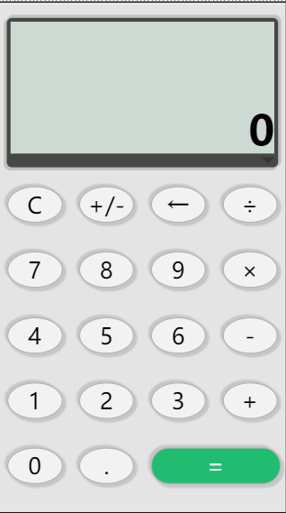
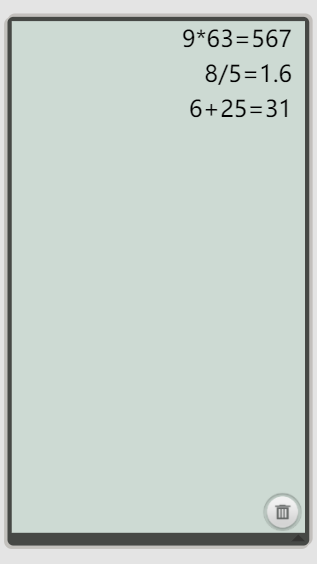

###  计算器demo介绍

#### 第2版功能及特点：
1.使用media和em实现简单的响应式布局 
2.支持标准的加减乘除四则运算 
3.可以进行连续运算 
4.使用了HTML5的localStorage进行运算记录的存储，可以进行删除操作

#### 第2版：
1.改用flex布局 
2.优化了界面，历史记录界面增加了自定义样式的滚动条。

虽然还有很多的bug。。。还在完善当中

#### 目前效果图：
  

